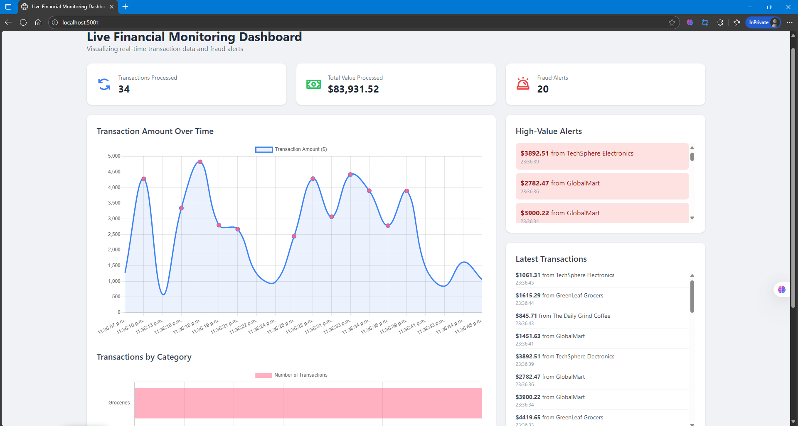
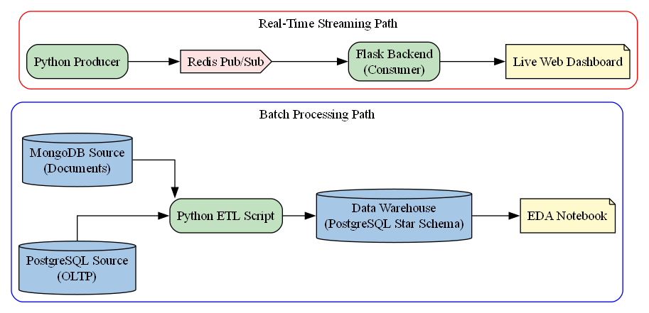
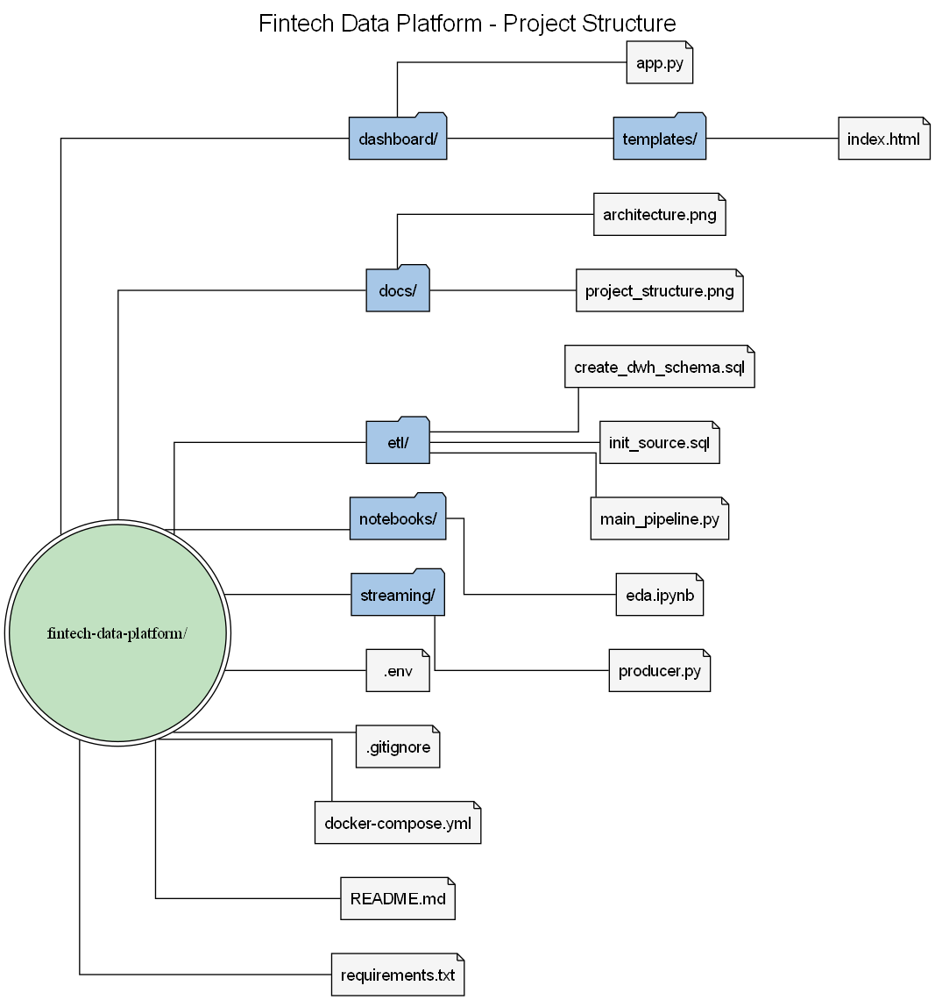
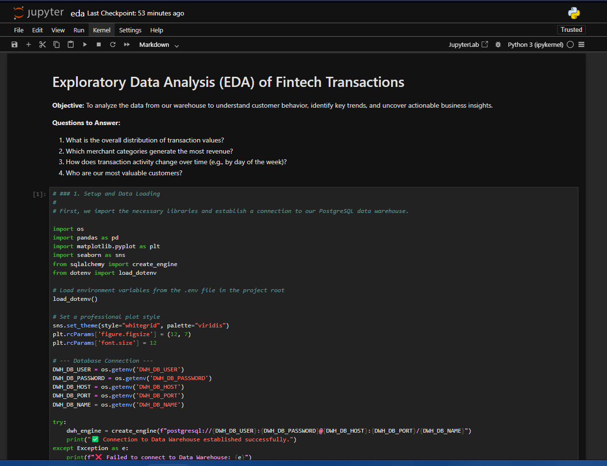

# Fintech Real-Time Data Platform


A comprehensive data engineering platform that demonstrates a full data lifecycle: from multi-source ingestion and batch ETL processing to real-time stream analytics and live visualization. This project uses an expanded dataset covering a full week of activity to provide more meaningful historical analysis.

---

## Features

* **Batch ETL Pipeline:** Extracts data from both relational (PostgreSQL) and document (MongoDB) databases, applies data quality and governance transformations, and loads it into a central data warehouse.
* **Data Warehouse:** Implements a Star Schema in PostgreSQL, optimized for fast and efficient analytical queries.
* **Real-Time Analytics:** Ingests a live stream of financial transactions via a Redis message broker.
* **Live Monitoring Dashboard:** A professional web-based dashboard built with Flask and Socket.IO that provides live KPI updates, charts, and prominent fraud alerts for high-value transactions (threshold > $3000).
* **Exploratory Data Analysis:** A detailed Jupyter Notebook is provided to perform deep-dive analysis on the historical data stored in the warehouse.
* **Data Governance & Quality:** Enforces PII protection by hashing sensitive data and ensures data integrity with built-in quality checks.
* **Containerized Environment:** The entire backend infrastructure is containerized with Docker and managed by a single Docker Compose file for easy and reproducible setup.

## Live Demo

The final output is a live dashboard that visualizes key metrics and alerts in real-time.



---

## Architecture & Project Structure

### System Architecture

The platform is built on a modern, containerized architecture that separates concerns and ensures reproducibility. The data flows through two distinct paths: a **batch path** for historical analysis and a **real-time path** for live monitoring.



### Project Directory Structure

The project is organized into logical modules for clarity and maintainability.



---

## Tech Stack

- **Language:** Python 3.10+
- **Databases:** PostgreSQL (Relational Source & DWH), MongoDB (Document Source)
- **Streaming:** Redis (Pub/Sub Message Broker)
- **ETL & Transformation:** Pandas, SQLAlchemy
- **Web Framework & Real-Time:** Flask, Flask-SocketIO
- **Analysis & Visualization:** Jupyter Notebook, Matplotlib, Seaborn, Chart.js
- **Containerization:** Docker, Docker Compose
- **Configuration:** python-dotenv

---

## Getting Started

This section provides a complete guide to setting up and running the project locally.

### Prerequisites

#### **Software**

You must have the following software installed on your system:

* **Git:** For cloning the repository. ([Download](https://git-scm.com/))
* **Python:** Version 3.10 or newer. ([Download](https://www.python.org/downloads/))
* **Docker Desktop:** For running the containerized services. **Must be running before you start.** ([Download](https://www.docker.com/products/docker-desktop/))

#### **VS Code Extensions (Recommended)**

If using Visual Studio Code, these extensions will improve your development experience:

* **Python** (by Microsoft)
* **Jupyter** (by Microsoft)
* **Docker** (by Microsoft)

### Installation & Execution Guide

Follow these steps in the exact order to ensure a smooth setup.

1.  **Clone the Repository:**
    Open your terminal, navigate to your desired directory, and run:
    ```sh
    git clone [https://github.com/YourUsername/fintech-data-platform-interview-project.git](https://github.com/YourUsername/fintech-data-platform-interview-project.git)
    cd fintech-data-platform-interview-project
    ```
    *(Remember to replace `YourUsername` with your actual GitHub username).*

2.  **Start All Backend Services:**
    This single command will start the PostgreSQL databases, MongoDB, and Redis in the background.
    ```sh
    docker-compose up -d
    ```
    *You can verify they are running with `docker ps`. All four containers should have a `(healthy)` or `Up` status.*

3.  **Set Up the Python Environment:**
    This creates an isolated environment for the project's Python packages.
    ```sh
    # Create the virtual environment
    python -m venv venv
    # Activate it (for Windows)
    .\venv\Scripts\activate
    ```
    *Your terminal prompt should now begin with `(venv)`.*

4.  **Install All Required Packages:**
    This command reads the `requirements.txt` file and installs every library needed for the project into your virtual environment.
    ```sh
    pip install -r requirements.txt
    ```

---

## How to Use the Platform

The project has three main components to run.

### 1. Run the Batch ETL Pipeline

This process populates the data warehouse with the expanded historical dataset. This must be run before you can perform the historical analysis.

* **Action:** Open a terminal (with `venv` active) and run:
    ```sh
    python etl/main_pipeline.py
    ```
* **Expected Output:** You will see logs confirming the `EXTRACTION`, `TRANSFORM`, and `LOAD` phases.

### 2. Perform Historical Analysis (EDA)

This component allows you to explore the cleaned and structured data in the warehouse to derive business insights.


*(Note: You should take a screenshot of your running notebook showing the charts and save it as `eda_screenshot.png` inside the `docs` folder for this image to appear).*

* **Action:** In a terminal (with `venv` active), run the Jupyter Notebook server:
    ```sh
    jupyter notebook notebooks/eda.ipynb
    ```
* **Expected Output:** A new tab will open in your web browser. Run the cells sequentially by pressing `Shift + Enter` to see the full analysis, including KPIs and visualizations.

### 3. Monitor the Real-Time Dashboard

This is the live monitoring component of the platform. It requires two separate terminals.

* **Action (Terminal 1):** Start the data producer.
    ```sh
    python streaming/producer.py
    ```
* **Action (Terminal 2):** Start the dashboard backend.
    ```sh
    python dashboard/app.py
    ```
* **View the Result:** Open your web browser and navigate to **`http://localhost:5001`**. You will see the live dashboard with updating KPIs, charts, and fraud alerts.